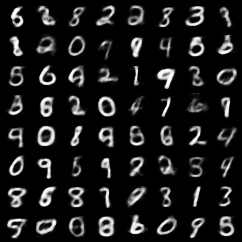

# AE
Implementation Code of AEs with PyTorch

## Preview of the result

| Model | Feature Representaion | Reconstruction | Generation | 
| :---: | :---: | :---: | :---: |
| [AutoEncoder](1.%20AutoEncoder.ipynb) |  |  |
| [Variational AutoEncoder](2.%20Variational%20AutoEncoder.ipynb) |  |  |  |
## Descriptions

1. [AE: AutoEncoder](1.%20AutoEncoder.ipynb)
2. [VAE: Variational AutoEncoder](2.%20Variational%20AutoEncoder.ipynb)
3. Convolutional Variational Autoencoder (In progress..)

### Why did I make this repository?

I'm afraid of forgetting how to build the model with PyTorch Code. I didn't want my modeling skills to die, and I wanted to make various Auto Encoder myself.