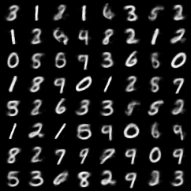

# AE
Implementation Code of AEs with PyTorch

## Preview of the result

| Model | Feature Representaion | Reconstruction | Generation | 
| :---: | :---: | :---: | :---: |
| AutoEncoder |  |  |
| [Variational AutoEncoder](https://arxiv.org/abs/1312.6114) |  |  |  |
| [Conditional Variational AutoEncoder](https://proceedings.neurips.cc/paper/2015/hash/8d55a249e6baa5c06772297520da2051-Abstract.html) |  |  |  |
## Descriptions

1. [AE: AutoEncoder](1.%20AutoEncoder.ipynb)
2. [VAE: Variational AutoEncoder](2.%20Variational%20AutoEncoder.ipynb)
3. [CVAE: Conditional Variational Autoencoder](3.%20Conditional%20Variational%20AutoEncoder.ipynb)
4. (To be continued...)

### Why did I make this repository?

I'm afraid of forgetting how to build the model with PyTorch Code. I didn't want my modeling skills to die, and I wanted to make various Auto Encoder myself.